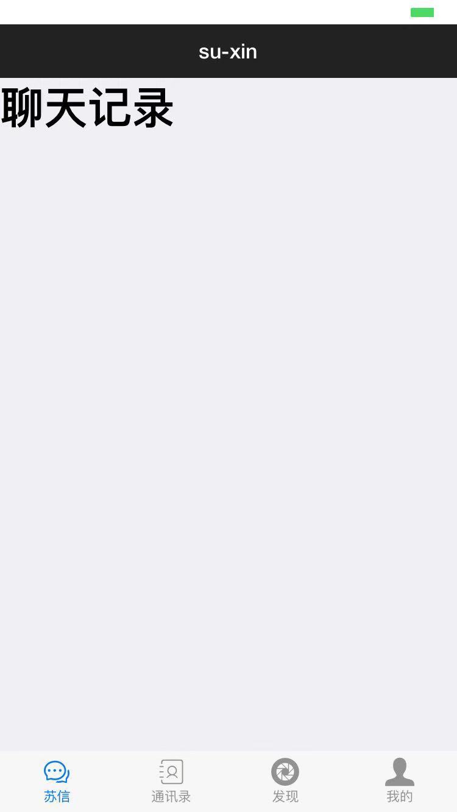
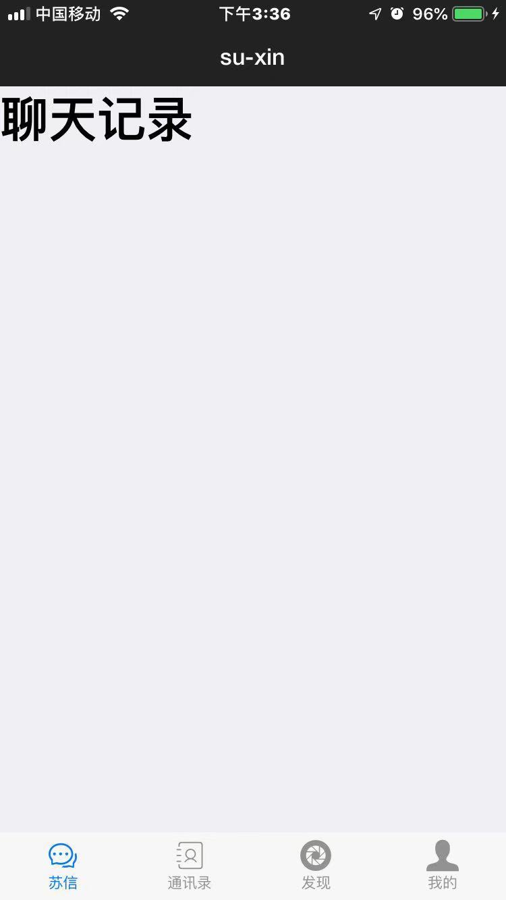

## 关于H5+设置ios设备的状态栏背景的小问题
## 环境

hbuilder 

iPhone6 ios12 

## 问题

如下代码是h5+的设置状态栏的背景的函数。

```javascript
plus.navigator.setStatusBarBackground();
```

但是我用以下的参数是不生效的：

```javascript
plus.navigator.setStatusBarBackground("black");
```

效果如下图：可以看到状态栏并没有变黑，而且我设置了字体为白色，所以出现以下效果。



## 解决方法：

不能使用代词去写，应该使用16进制的rgb色位去写

如下：

```javascript
plus.navigator.setStatusBarBackground("#C9394A");
```

更改后的效果图：




