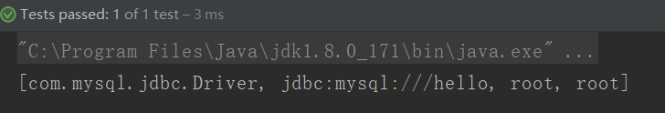

# Java读取properties配置

实际开发中，我们一般情况下，会把配置相关的信息，放在 xx.properties 中保存，并且使用。因为，以后代码有可能写得非常复杂，像一些不经常改动的东西，都建议抽取出来保存到配置文件中。当我们要用的时候，直接从配置文件中获取使用。当我们需要修改的时候，显示找到文件，然后就可以直接修改即可

## 码云代码地址

https://gitee.com/suwenguang/SpringFrameworkDemo

> 注意这个工程还有我其他demo，本文目录在spring.my.suveng.Java读取properties 目录里面

1. 新建 test.properties 配置文件 

   ```properties
   driver=com.mysql.jdbc.Driver
   url=jdbc:mysql:///hello
   user=root
   password=1234
   ```

2. 编写工具类

   ```java
   /**
    * author Veng Su
    * email suveng@163.com
    * date 2018/8/16 19:30
    */
   public class ReadProperties {
       public void loadProperties() throws IOException {
   //    1.找到文件，加载文件
   //        1.使用java.util.Properties类的load()方法：
           InputStream is = new BufferedInputStream(new FileInputStream("src/main/java/spring/my/suveng/Java读取properties/properties/test.properties"));
           Properties properties = new Properties();
           properties.load(is);
   //    2. 通过输入流加载数据
           getData(properties);
       }
   
       private void getData(Properties properties) {
           List<String> list = new ArrayList<String>();
           list.add(properties.getProperty("driver"));
           list.add(properties.getProperty("url"));
           list.add(properties.getProperty("user"));
           list.add(properties.getProperty("password"));
           System.out.println(list);
       }
   
       @Test
       public void test() throws IOException {
           ReadProperties readProperties=new ReadProperties();
           readProperties.loadProperties();
       }
   }
   ```

## 测试

```java
@Test
public void test() throws IOException {
    ReadProperties readProperties=new ReadProperties();
    readProperties.loadProperties();
}
```
## 运行结果：



加油