# virtualbox只能选用网络地址转换（NAT）模式下搭建个人局域网

这里先引用以为大佬的博客，上面清楚的介绍虚拟机网络的集中配置。

我这里简单说一下网络地址转换，详细请查阅https://blog.csdn.net/gsl371/article/details/78662258

### 网络地址转换(NAT)

#### 特点

​		1、如果主机可以上网，虚拟机可以上网
​		2、虚拟机之间不能ping通
​		3、虚拟机可以ping通主机（此时ping虚拟机的网关，即是ping主机）
​		4、主机不能ping通虚拟机

#### 应用场景

​		虚拟机只要求可以上网，无其它特殊要求，满足最一般需求

#### 配置方法

​		连接方式 选择 网络地址转换（NAT）
​		高级-控制芯片 选择 PCnet-FAST III
​		高级-混杂模式 拒绝
​		高级-接入网线 √
​		（虚拟机ip自动获取）

#### ip样式

ip 10.0.2.15

网关 10.0.2.2

注意此处的网关在不同虚拟机中可能是同一个值，但是这归属于不同的NAT Engine，因此实际上各个虚拟机用的不是同一个网关

#### 原理

虚拟机的请求传递给NAT Engine，由它来利用主机进行对外的网络访问，返回的数据包再由NAT Engine给虚拟机。

> 缘由：为什么不用最简单的桥接模式呢？
>
> 因为公司已经有子网，而且是虚拟网卡。总之就是不能选桥接模式

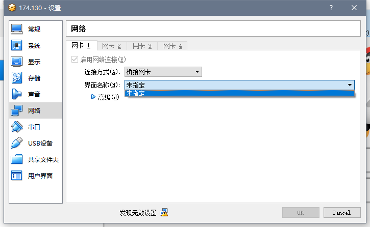

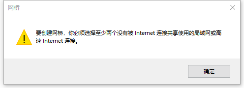

## 搭建过程

如何搭建一个个人局域网呢？

如下图的拓扑图：

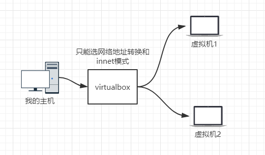

但是实际虚拟出来的拓扑图是这样的。虚拟机之间是隔离开的，互相之间是不能ping通的。

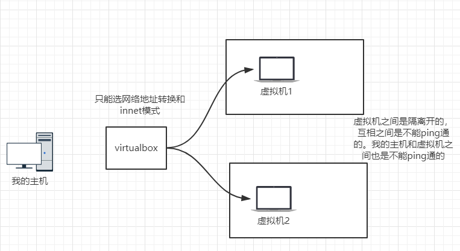

### 那怎么做呢？

1. 网络地址装换部分有个**高级设置**选项，可以设置端口转发
   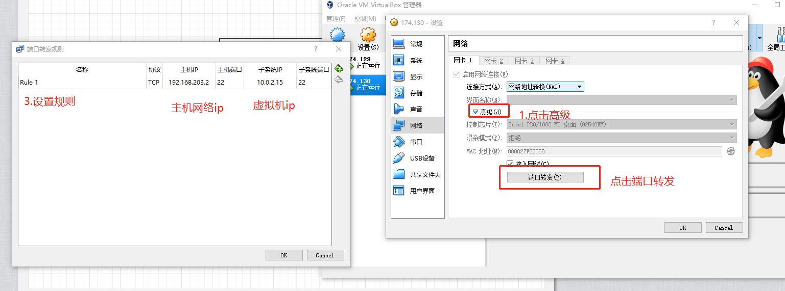

2. 我的网络状态
   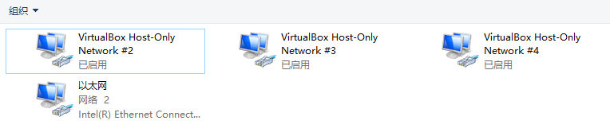

3. 我的主机的网络ip状态
   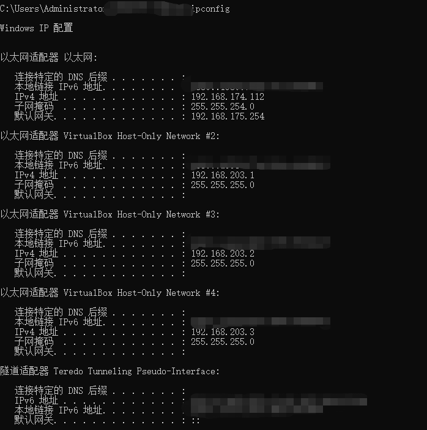

4. 两台虚拟机的网络ip
   虚拟机1

   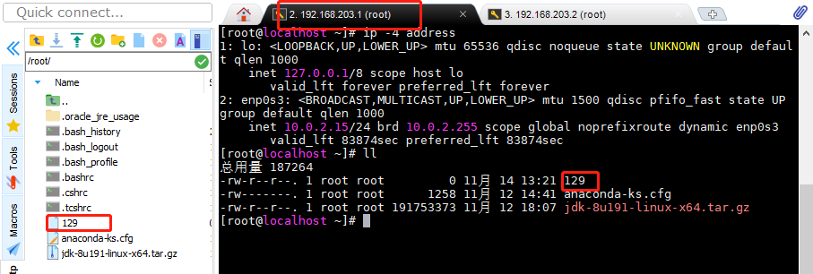

   虚拟机2

   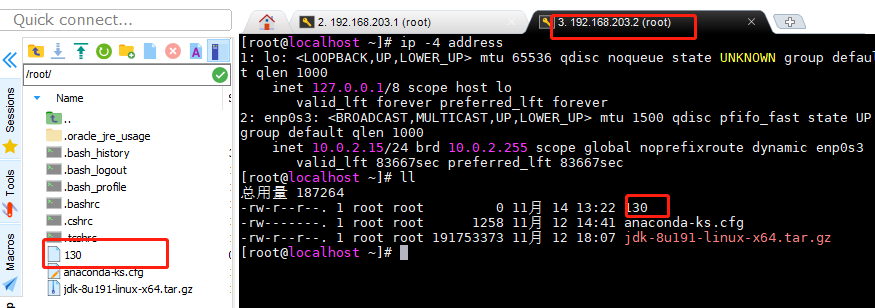

当我设置好这些东西的时候，这时候的网络拓扑应该是这样的，可能画的有偏差。

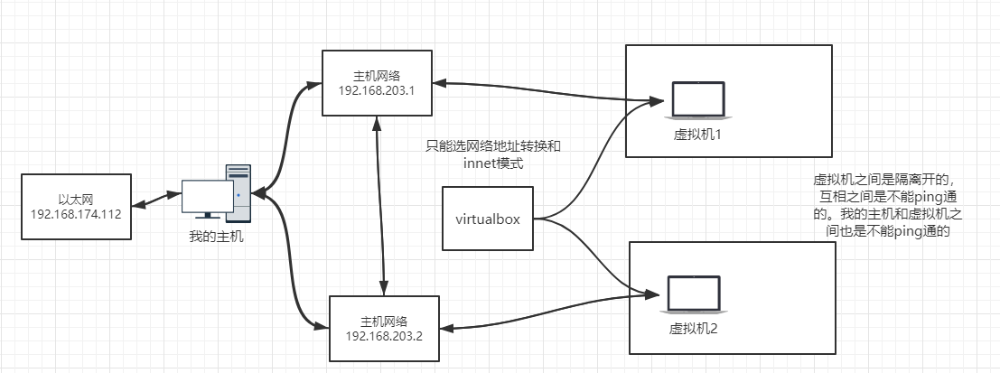

主机网络就相当于一个代理转发。这样子就可以ping通了。

## 测试

这样子，理论上如果我的主机能够脸上虚拟机1，就证明主机到虚拟机是通的。而事实上上面的截图已经证明了。

那么剩下虚拟机和虚拟机之间的连接了，怎么证明？

用虚拟机1 ssh 连接上 虚拟机2 就行了。 

> 注意：这里为了方便我把centos7的防火墙关了

### 开始测试

192.168.203.1使用ssh root@192.168.203.2

结果如下：

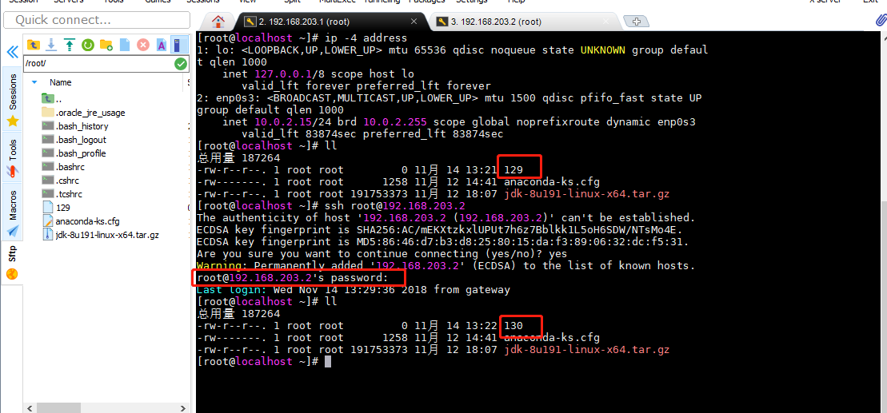

关键就是前一个是文件是129，连接上后显示的文件是130；虚拟机2的文件就是130；如下图

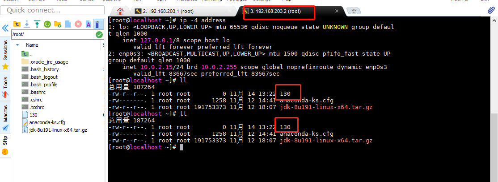

