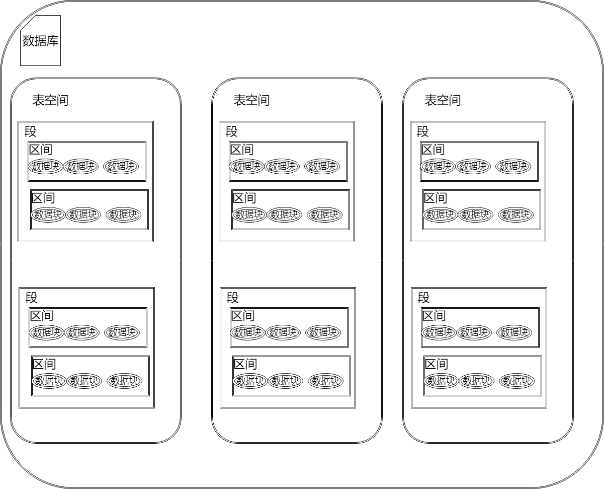

## Oracle

Oracle数据库是Oracle公司开发和销售的一种对象关系数据库管理系统。 Oracle数据库通常被称为Oracle RDBMS或简称为Oracle。 

Oracle数据库服务器由一个数据库和至少一个数据库实例组成。 数据库是一组存储数据的文件，而数据库实例是一组管理数据库文件的内存结构。 另外，数据库由后台进程组成。 下图说明了Oracle数据库服务器体系结构： 

 

### 物理存储结构

1. 定义
   物理的存储结构是存储数据的纯文件。
2. create database将创建以下文件
   1. 数据文件：数据文件包含真实数据
   2. 控制文件：每个Oracle的数据库都有一个包含元数据的控制文件
      元数据定义：描述数据库的物理结构，包括数据库名称和数据库文件位置。
   3. 联机重做日志文件：由重做条目构成，记录对数据所做的所有更改。

### 逻辑存储结构

1. 数据块（data blocks）数据块对应于磁盘上的字节数。Oracle将数据存储在数据块中。数据块也被称为逻辑块，Oracle块或页。 
2. 范围（extents）范围是用于存储特定类型信息的逻辑连续数据块的具体数量。 
3. 段（segments）段是分配用于存储用户对象(例如表或索引)的一组范围。 
4. 表空间（table spaces）数据库被分成称为表空间的逻辑存储单元。 表空间是段的逻辑容器。 每个表空间至少包含一个数据文件。 
   1. 一个ORACLE数据库能够有一个或多个表空间,而一个表空间则对应着一个或多个物理的数据库文件。
   2. 表空间是ORACLE数据库恢复的最小单位,容纳着许多数据库实体,如表、视图、索引、聚簇、回退段和临时段等。
   3. 每个ORACLE数据库均有SYSTEM表空间,这是数据库创建时自动创建的。

逻辑结构如下所示：

从逻辑的角度来看，一个数据库（database）下面可以分多个表空间（tablespace）；一个表空间下面又可以分多个段（segment）；一个数据表要占一个段（segment），一个索引也要占一个段（segment ）。 一个段（segment）由多个 区间（extent）组成，那么一个区间又由一组连续的数据块（data block）组成。这连续的数据块是在逻辑上是连续的，有可能在物理磁盘上是分散。 

下图说明了表空间中的段，范围和数据块： 

 

下图显示了逻辑和物理存储结构之间的关系： 

 

Oracle实例由三个主要部分组成：系统全局区(SGA)，程序全局区(PGA)和后台进程 ：

 

## 参考文献

https://www.cnblogs.com/fnng/archive/2012/08/12/2634485.html

http://www.oraok.com/quickstart/what-is-oracle-database.html