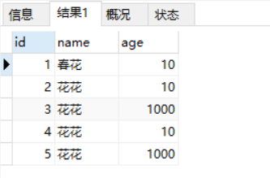

# MyBatis入门

## 码云代码地址

https://gitee.com/suwenguang/SpringFrameworkDemo

> 注意这个工程还有我其他demo，本文目录在`spring.my.suveng.mybatis.mybatis入门` 目录里面

## 搭建MyBatis开发环境

### 我的数据库：



### 步骤：

1. 导入jar包，使用的maven
2. 添加mybatis的核心配置文件。
3. 准备映射文件***mapper.xml
4. 准备映射类（期望类型的类，用于参数传递或者结果封装）
5. 使用mybatis
6. 测试
7. 测试结果

### 导入jar包

pom.xml

```xml
<!--mybatis -->
<dependency>
    <groupId>org.mybatis</groupId>
    <artifactId>mybatis</artifactId>
    <version>RELEASE</version>
</dependency>
<!--end-->
```

### 添加mybatis的核心配置文件

mybatis.xml

```xml
<?xml version="1.0" encoding="UTF-8" ?>
<!DOCTYPE configuration
        PUBLIC "-//mybatis.org//DTD Config 3.0//EN"
        "http://mybatis.org/dtd/mybatis-3-config.dtd">

<configuration>
    <environments default="development">
        <environment id="development">
            <transactionManager type="JDBC"/>
            <dataSource type="POOLED">
                <property name="driver" value="com.mysql.cj.jdbc.Driver"/>
                <property name="url"
                          value="jdbc:mysql://localhost:3306/suveng?serverTimezone=Asia/Shanghai &amp;characterEncoding=utf8"/>
                <property name="username" value="root"/>
                <property name="password" value="root"/>
            </dataSource>
        </environment>
    </environments>
    <mappers>
        <mapper resource="spring/my/suveng/mybatis/mybatis入门/dao/mapper/UserMapper.xml"/>
    </mappers>
</configuration>
```

### 准备映射文件***mapper.xml

```xml
<?xml version="1.0" encoding="UTF-8" ?>
<!DOCTYPE mapper
        PUBLIC "-//mybatis.org//DTD Mapper 3.0//EN"
        "http://mybatis.org/dtd/mybatis-3-mapper.dtd">
<mapper namespace="spring.my.suveng.mybatis.mybatis入门.dao.UserMapper">

    <select id="selectUserById" resultType="spring.my.suveng.mybatis.mybatis入门.user.User" parameterType="spring.my.suveng.mybatis.mybatis入门.user.User">
        select * from user where id=#{id}
    </select>
</mapper>  
```

### 准备映射类（期望类型的类，用于参数传递或者结果封装）

```java
/**
 * author Veng Su
 * email suveng@163.com
 * date 2018/8/16 9:17
 */
public class User implements Serializable {
    int id;
    String name;
    int age;

    public int getId() {
        return id;
    }

    public void setId(int id) {
        this.id = id;
    }

    public String getName() {
        return name;
    }

    public void setName(String name) {
        this.name = name;
    }

    public int getAge() {
        return age;
    }

    public void setAge(int age) {
        this.age = age;
    }

    @Override
    public String toString() {
        return "User{" +
                "id=" + id +
                ", name='" + name + '\'' +
                ", age=" + age +
                '}';
    }
}
```

### 测试使用mybatis

```java

/**
 * author Veng Su
 * email suveng@163.com
 * date 2018/8/16 9:23
 */

public class MybatisTest {
    @Test
    public void test1() throws IOException {
        InputStream is = Resources.getResourceAsStream("spring/my/suveng/mybatis/mybatis入门/config/mybatis.xml");
        SqlSessionFactory sqlSessionFactory = new SqlSessionFactoryBuilder().build(is);
        SqlSession sqlSession = sqlSessionFactory.openSession();
        User user = new User();
        user.setId(1);
        List<User> list = sqlSession.selectList("selectUserById", user);
        for (User user1 : list
        ) {
            System.out.println(user1);
        }
        sqlSession.commit();
        sqlSession.close();

    }
}

```

### 运行结果：


