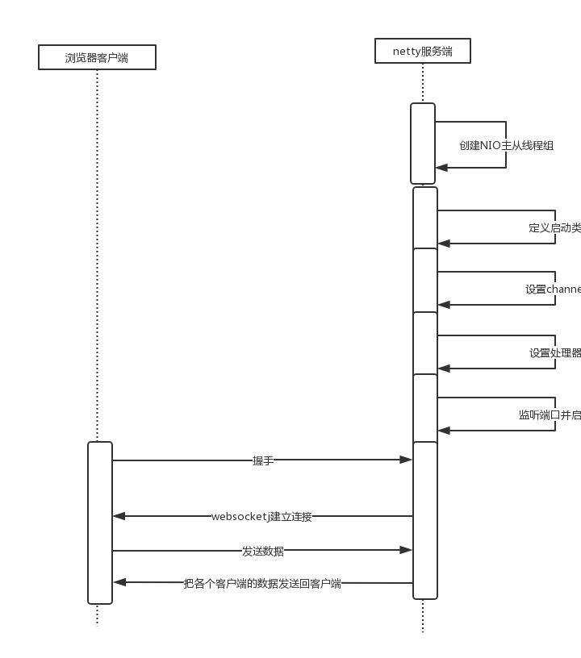
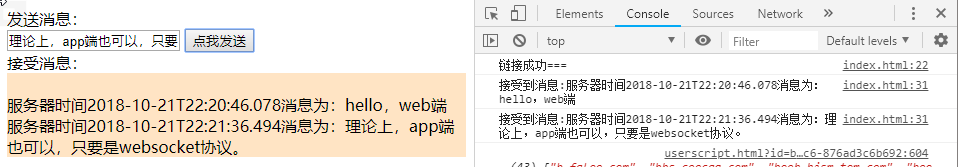

# 基于netty的websocket协议的对话小程序

## 目的：

开发一个和服务端对话的小程序demo

### 客户端：h5页面+原生js

### 服务端：基于websocket协议的netty小程序demo

## 流程逻辑：



## 核心代码：

### 代码地址： [码云地址](https://gitee.com/suwenguang/nettyhello/tree/%E4%BD%BF%E7%94%A8netty%E7%9A%84websocket%E5%AE%9E%E7%8E%B0%E8%81%8A%E5%A4%A9/)

### 服务端代码

#### wsserver.java

```java
package my.suveng.nettyhello.module.wsserver;

import io.netty.bootstrap.ServerBootstrap;
import io.netty.channel.ChannelFuture;
import io.netty.channel.nio.NioEventLoopGroup;
import io.netty.channel.socket.nio.NioServerSocketChannel;

/**
 * create at 2018/10/21
 * author: suveng
 * email: suveng@163.com
 **/
public class Wsserver {
    public static void main(String[] args) throws InterruptedException {
        NioEventLoopGroup main = new NioEventLoopGroup();
        NioEventLoopGroup sub = new NioEventLoopGroup();
        try {
            ServerBootstrap serverBootstrap = new ServerBootstrap();
            serverBootstrap.group(main, sub)
                    .channel(NioServerSocketChannel.class)
                    .childHandler(new WsServerInitializer());

            ChannelFuture future = serverBootstrap.bind(8888).sync();

            future.channel().closeFuture().sync();
        }finally {
            main.shutdownGracefully();
            sub.shutdownGracefully();
        }

    }
}

```

#### WsServerInitializer.java

```java
package my.suveng.nettyhello.module.wsserver;

import io.netty.channel.Channel;
import io.netty.channel.ChannelHandler;
import io.netty.channel.ChannelInitializer;
import io.netty.channel.ChannelPipeline;
import io.netty.handler.codec.http.HttpObjectAggregator;
import io.netty.handler.codec.http.HttpServerCodec;
import io.netty.handler.codec.http.websocketx.WebSocketServerProtocolHandler;
import io.netty.handler.stream.ChunkedWriteHandler;

/**
 * create at 2018/10/21
 * author: suveng
 * email: suveng@163.com
 **/
public class WsServerInitializer extends ChannelInitializer {
    protected void initChannel(Channel ch) throws Exception {
        ChannelPipeline pipeline = ch.pipeline();
//        websocket 给予http 协议
        pipeline.addLast(new HttpServerCodec());
//写大数据
        pipeline.addLast(new ChunkedWriteHandler());
//        对httpmsg 聚合成 httprequest httpresponse
        pipeline.addLast(new HttpObjectAggregator(1024*64));
//        =======================以上用于支持http协议================================
//        这个是websocket服务器处理协议，用于指定给客户端链接访问的路由：/ws
//        这个handler 会帮助你处理一些繁重的复杂的事
        pipeline.addLast(new WebSocketServerProtocolHandler("/ws"));
//添加自定义的handler
        pipeline.addLast(new CustomHandler());
    }
}

```

#### customhandler.java

```java
package my.suveng.nettyhello.module.wsserver;

import io.netty.channel.Channel;
import io.netty.channel.ChannelHandlerContext;
import io.netty.channel.SimpleChannelInboundHandler;
import io.netty.channel.group.ChannelGroup;
import io.netty.channel.group.DefaultChannelGroup;
import io.netty.handler.codec.http.websocketx.TextWebSocketFrame;
import io.netty.handler.codec.http.websocketx.WebSocketFrame;
import io.netty.util.concurrent.GlobalEventExecutor;

import java.time.LocalDate;
import java.time.LocalDateTime;

/**
 * create at 2018/10/21
 * author: suveng
 * email: suveng@163.com
 **/
public class CustomHandler extends SimpleChannelInboundHandler<TextWebSocketFrame> {
    private static ChannelGroup clients=new DefaultChannelGroup(GlobalEventExecutor.INSTANCE);

    protected void channelRead0(ChannelHandlerContext ctx, TextWebSocketFrame msg) throws Exception {
        String text = msg.text();
        System.out.println("接受到的数据"+text);

        for (Channel channel : clients){
            channel.writeAndFlush(new TextWebSocketFrame("服务器时间"+ LocalDateTime.now()+"消息为："+text));
        }
    }

    @Override
    public void handlerAdded(ChannelHandlerContext ctx) throws Exception {
        clients.add(ctx.channel());
    }

    @Override
    public void handlerRemoved(ChannelHandlerContext ctx) throws Exception {
//        clients.remove(ctx.channel());
        System.out.println( "ctx.channel().id().asLongText()="+ctx.channel().id().asLongText());
        System.out.println("ctx.channel().id().asShortText()="+ctx.channel().id().asShortText());
    }

}

```

#### 客户端代码

```html
<!DOCTYPE html>
<html>
	<head>
		<meta charset="utf-8" />
		<title></title>
	</head>
	<body>
		<div>发送消息：</div>
		<input type="text" id="msgContent" />
		<input type="button" value="点我发送" onclick="CHAT.chat()" />

		<div>接受消息：</div>
		<div id="receiveMsg" style="background-color: bisque;"></div>
	</body>
	<script type="application/javascript">
		window.CHAT = {
			socket: null,
			init: function() {
				if (window.WebSocket) {
					CHAT.socket = new WebSocket("ws://192.168.1.200:8888/ws");
					CHAT.socket.onopen = function() {
						console.log("链接成功===");					
					},
					CHAT.socket.onclose=function(){
						console.log("连接关闭====")
					},
					CHAT.socket.onerror=function(){
						console.log("连接发生错误====")
					},
					CHAT.socket.onmessage=function(e){
						console.log("接受到消息:"+e.data);
						var receiveMsg=document.getElementById("receiveMsg");
						var html=receiveMsg.innerHTML;
						receiveMsg.innerHTML=html+"<br/>"+e.data;
					}
				
				} else {
					alert("浏览器不支持websocket");
				}

			},
			chat: function() {
				var msg=document.getElementById("msgContent");
				
				CHAT.socket.send(msg.value);
				
			}
		}
		CHAT.init();
		
	</script>
</html>

```

## 效果

