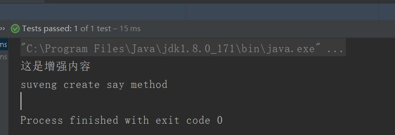
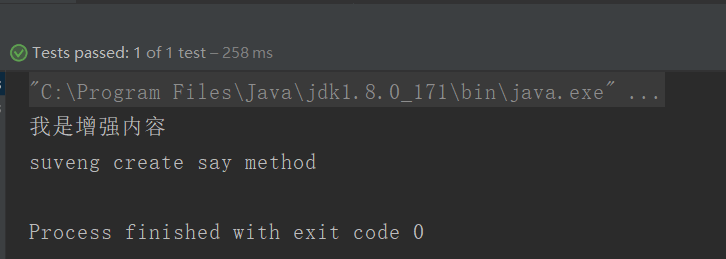

# AOP原理之动态代理

实现AOP的底层是反射机制，其中有两种实现方式：

其一是JDK的动态代理；

其二是基于CGLib的动态代理；

这里用简单的demo来演示两种方式的过程：

## 基于JDK的动态代理

JDK的动态代理是必须要一个接口来实现，那么现在来创建这个接口：

UserDao.java

```java
**
 * @author Veng Su 1344114844@qq.com
 * @date 2018/8/13 10:52
 */
public interface UserDao {
    public void say();
    public void ask();
}
```

接着我们来创建一个接口的实现类：

UserDaoImpl.java

```java
/**
 * @author Veng Su 1344114844@qq.com
 * @date 2018/8/13 10:52
 */
public class UserDaoImpl implements UserDao {
    public void say() {
        System.out.println("suveng create say method");
    }

    public void ask() {
        System.out.println("suven create ask method");
    }
}
```

现在接口和实现类都准备好了，我们可以开始实现一个代理类了。

JDKProxy.java

```java
/**
 * @author Veng Su 1344114844@qq.com
 * @date 2018/8/13 10:53
 */
// 思路：先把需要代理增强的东西传进来，接着增强之后再把新的返回出去
public class JDKProxy {
    //新建方法返回增强类
    public static UserDao getUserDaoProxy(final UserDao userDao){
        //1.获取类加载器
        ClassLoader userDaoClassLoader=userDao.getClass().getClassLoader();
        //2. 获取接口
        Class<?>[] interfaces=userDao.getClass().getInterfaces();
        //3.创建代理类
        UserDao userDaoProxy= (UserDao) Proxy.newProxyInstance(userDaoClassLoader, interfaces, new InvocationHandler() {
            public Object invoke(Object proxy, Method method, Object[] args) throws Throwable {
                //开始写增强内容
                if (method.getName().equals("say")){
                    System.out.println("这是增强内容");
                }
                return method.invoke(userDao,args);
            }
        });
        return userDaoProxy;
    }
}
```

好了，到这里我们的代理已经创建好了，主要是使用了Proxy.newProxyInstance（）这个方法创建一个代理类，然后把这个代理类返回。接下来我们就可以用JDKProxy来创建一个被代理后的UserDao这个增强类。

> 为什么需要接口？
>
> 因为Proxy.newProxyInstance()这个方法的参数需要传入一个接口的参数，所以用JDK创建动态代理需要一个接口类。

接下来我们来测试一下：

```java
@org.junit.Test
public void testJDKProxy(){
    UserDao userDao= JDKProxy.getUserDaoProxy(new UserDaoImpl());
    userDao.say();
}
```

运行结果如下图所示：



## 基于CGLib的动态代理：

> CGLIB(Code Generation Library)是一个开源项目！
>
> 是一个强大的，高性能，高质量的Code生成类库，它可以在运行期扩展Java类与实现Java接口。
>
> 摘自百度百科

JDK的动态代理用起来非常简单，但它有一个限制，就是使用动态代理的对象必须实现一个或多个接口。如果想代理没有实现接口的继承的类，该怎么办？

现在我们可以使用CGLIB包 

首先我们需要准备一个类，随便一个类。那我们复用UserDaoImpl的类，把它改造一下

User.java

```java
/**
 * @author Veng Su 1344114844@qq.com
 * @date 2018/8/13 10:52
 */
public class User  {
    public void say() {
        System.out.println("suveng create say method");
    }

    public void ask() {
        System.out.println("suven create ask method");
    }
}
```

接下我们创建一个代理类；

CGLibProxy.java

```java
/**
 * author: Veng Su
 * email: suveng@163.com
 * date: 2018/8/13 14:33
 */
public class CGLibProxy {
    public static User getProxy(){
        //1.创建CGLib核心类
        Enhancer enhancer=new Enhancer();
        //2. 制定需要代理的类，也就是父类
        enhancer.setSuperclass(User.class);
        //3. 设置回调函数
        enhancer.setCallback(new MethodInterceptor() {
            public Object intercept(Object o, Method method, Object[] objects, MethodProxy methodProxy) throws Throwable {
                if (method.getName().equals("say")){
                    System.out.println("我是增强内容");
                }
                return methodProxy.invokeSuper(o,objects);
            }
        });
        //4. 生成代理对象
        User userDaoProxy= (User) enhancer.create();
        return userDaoProxy;
    }

}
```

这就实现了一个CGLib代理类。

> 注意：methodProxy.invokeSuper(o,objects);这里要调用的父类的方法，如果调用methodProxy.invoke(o,objects);会无线调用导致堆栈溢出。

测试：

```java
@Test
public void testCGLibProxy(){
    User user= CGLibProxy.getProxy();
    user.say();
}
```

运行结构如下图所示：



## 码云源码地址

https://gitee.com/suwenguang/SpringFrameworkDemo

## 总结

其实学习动态代理还要很长的路要走，这里只是简单的实现。目前写业务的我理解到这里就OK，够用了，如果还有需要深入理解动态的话，建议去把JDK的反射包的源码和CGLib的源码了解一遍。加油！