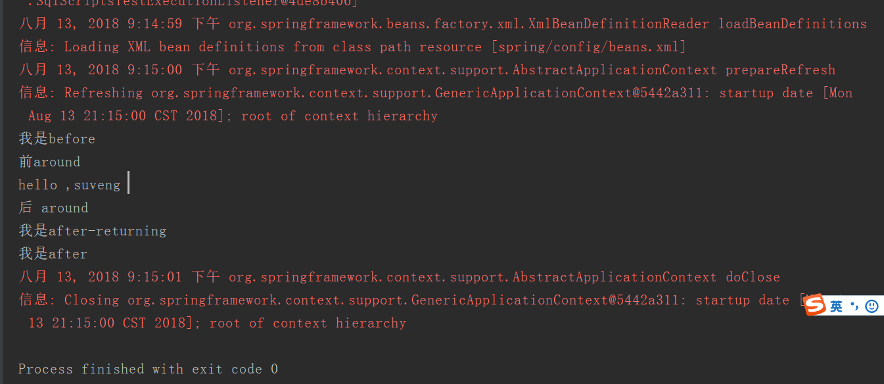

# Spring 中的AOP的通知类型的示例

AOP中的通知类型（advice）一共有五中：

1. around advice 环绕通知
2. before advice 前置通知
3. after advice 返回通知
4. after-throwing advice 异常返回通知 
5. after-returning advice 正常返回通知

具体详情请查看Spring的官方文档：https://docs.spring.io/spring/docs/5.0.8.RELEASE/spring-framework-reference/core.html#aop-api-advice

> 那么现在我们来搭建spring的环境。
>
> 你可以用很多中方式搭建spring的环境，可以自己导jar包，可以用maven，可以用gradle。
>
> 那么我用的是maven。如果想下载spring的文档和jar包，spring官网是下载不了的，需要去到ftp网址。
>
> 这里提供网址：https://docs.spring.io/spring/docs/
>
> 这里面有spring每一个版本的jar 和docs 文档

那么我用maven，新建一个空的maven工程，然后吧依赖导进去，我这里按照spring模块划分依赖。

pom.xml

```xml
<?xml version="1.0" encoding="UTF-8"?>
<project xmlns="http://maven.apache.org/POM/4.0.0"
         xmlns:xsi="http://www.w3.org/2001/XMLSchema-instance"
         xsi:schemaLocation="http://maven.apache.org/POM/4.0.0 http://maven.apache.org/xsd/maven-4.0.0.xsd">
    <modelVersion>4.0.0</modelVersion>

    <groupId>my.suveng</groupId>
    <artifactId>springcoredemo</artifactId>
    <version>1.0-SNAPSHOT</version>

    <properties>
        <org.springframework.version>5.0.8.RELEASE</org.springframework.version>
    </properties>

    <dependencies>
        <!-- spring start -->

        <!--spring core start-->
        <dependency>
            <groupId>org.springframework</groupId>
            <artifactId>spring-beans</artifactId>
            <version>${org.springframework.version}</version>
        </dependency>
        <dependency>
            <groupId>org.springframework</groupId>
            <artifactId>spring-core</artifactId>
            <version>${org.springframework.version}</version>
        </dependency>
        <dependency>
            <groupId>org.springframework</groupId>
            <artifactId>spring-context</artifactId>
            <version>${org.springframework.version}</version>
        </dependency>
        <dependency>
            <groupId>org.springframework</groupId>
            <artifactId>spring-expression</artifactId>
            <version>${org.springframework.version}</version>
        </dependency>
        <dependency>
            <groupId>org.springframework</groupId>
            <artifactId>spring-context-support</artifactId>
            <version>${org.springframework.version}</version>
        </dependency>
        <dependency>
            <groupId>org.springframework</groupId>
            <artifactId>spring-context-indexer</artifactId>
            <version>${org.springframework.version}</version>
        </dependency>
        <!--spring core end-->

        <!--spring aop start-->
        <dependency>
            <groupId>org.springframework</groupId>
            <artifactId>spring-aop</artifactId>
            <version>${org.springframework.version}</version>
        </dependency>
        <!--spirng aop end-->

        <!--spring aspects start-->
        <dependency>
            <groupId>org.springframework</groupId>
            <artifactId>spring-aspects</artifactId>
            <version>${org.springframework.version}</version>
        </dependency>
        <!--spring aspects end-->

        <!--spring instrumentation start -->
        <dependency>
            <groupId>org.springframework</groupId>
            <artifactId>spring-instrument</artifactId>
            <version>${org.springframework.version}</version>
        </dependency>
        <!--spring instrumentation end-->

        <!--spring messaging start -->
        <dependency>
            <groupId>org.springframework</groupId>
            <artifactId>spring-messaging</artifactId>
            <version>${org.springframework.version}</version>
        </dependency>
        <!--spring messaging end-->

        <!--spring data access start -->
        <dependency>
            <groupId>org.springframework</groupId>
            <artifactId>spring-jdbc</artifactId>
            <version>${org.springframework.version}</version>
        </dependency>
        <dependency>
            <groupId>org.springframework</groupId>
            <artifactId>spring-orm</artifactId>
            <version>${org.springframework.version}</version>
        </dependency>
        <dependency>
            <groupId>org.springframework</groupId>
            <artifactId>spring-oxm</artifactId>
            <version>${org.springframework.version}</version>
        </dependency>
        <dependency>
            <groupId>org.springframework</groupId>
            <artifactId>spring-jms</artifactId>
            <version>${org.springframework.version}</version>
        </dependency>
        <dependency>
            <groupId>org.springframework</groupId>
            <artifactId>spring-tx</artifactId>
            <version>${org.springframework.version}</version>
        </dependency>
        <!--spring data access end-->

        <!--spring web start -->
        <dependency>
            <groupId>org.springframework</groupId>
            <artifactId>spring-websocket</artifactId>
            <version>${org.springframework.version}</version>
        </dependency>
        <dependency>
            <groupId>org.springframework</groupId>
            <artifactId>spring-web</artifactId>
            <version>${org.springframework.version}</version>
        </dependency>
        <dependency>
            <groupId>org.springframework</groupId>
            <artifactId>spring-webmvc</artifactId>
            <version>${org.springframework.version}</version>
        </dependency>
        <dependency>
            <groupId>org.springframework</groupId>
            <artifactId>spring-webflux</artifactId>
            <version>${org.springframework.version}</version>
        </dependency>
        <!--spring web end -->

        <!--spring test start -->
        <dependency>
            <groupId>org.springframework</groupId>
            <artifactId>spring-test</artifactId>
            <version>${org.springframework.version}</version>
        </dependency>
        <!--spring test end -->
        <!-- spring end -->
        <!--junit4-->
        <dependency>
            <groupId>junit</groupId>
            <artifactId>junit</artifactId>
            <version>4.12</version>
        </dependency>
        <!--end-->
    </dependencies>
<build>
    <resources>
        <resource>
            <directory>src/main/java</directory>
            <includes>
                <include>**/*.xml</include>
            </includes>
        </resource>
    </resources>
</build>

</project>
```

配置好spring环境后，需要准备一些类来做切点，这里我才用哦面向接口，先建一个UserDao接口和一个实现类，然后将实现类交给spring去管理（使用注解方式）

UserDao.java

```java
/**
 * author: Veng Su
 * email: suveng@163.com
 * date: 2018/8/13 15:11
 */
public interface UserDao {
    public void say();
}
```

UserDaoImpl.java

```java
/**
 * author: Veng Su
 * email: suveng@163.com
 * date: 2018/8/13 15:12
 */
@Component(value = "userDao")
public class UserDaoImpl implements UserDao {
    public void say() {
//        int i=10/0;
        System.out.println("hello ,suveng ");

    }
}
```

这里使用注解，需要用到包扫描注解。

例如：`<context:component-scan base-package="spring.my.suveng"/>`

到这里切点已经准备好了，那么切面类需要准备一下，也就是增强的内容。

这里新建一个myAspect.java，把它交给spring管理

myAspect.java

```java
/**
 * author: Veng Su
 * email: suveng@163.com
 * date: 2018/8/13 15:25
 */
@Component(value = "myAspect")
public class myAspect {
    //before 切
    public void beforeF(){
        System.out.println("我是before");
    }
    //after 切
    public void afterF(){
        System.out.println("我是after");
    }
    //after_throwing 切
    public void afterTF(){
        System.out.println("我是after-throwing");
    }
    //after-returning 切
    public void afterRF(){
        System.out.println("我是after-returning");
    }
    //around 切 要把joinpoint给传进来
    public void aroundF(ProceedingJoinPoint joinPoint){
        System.out.println("前around");
        try {
            joinPoint.proceed();
        } catch (Throwable throwable) {
            throwable.printStackTrace();
        }
        System.out.println("后 around");

    }
}
```

既然切点和切面类已经准备好了，那么可以开始用xml配置了。

beans.xml

```xml
<?xml version="1.0" encoding="UTF-8"?>

<beans xmlns="http://www.springframework.org/schema/beans"
       xmlns:xsi="http://www.w3.org/2001/XMLSchema-instance"
       xmlns:context="http://www.springframework.org/schema/context"
       xmlns:aop="http://www.springframework.org/schema/aop"
       xsi:schemaLocation="http://www.springframework.org/schema/beans
        http://www.springframework.org/schema/beans/spring-beans.xsd
        http://www.springframework.org/schema/context
        http://www.springframework.org/schema/context/spring-context.xsd
        http://www.springframework.org/schema/aop
        http://www.springframework.org/schema/aop/spring-aop.xsd">

    <context:component-scan base-package="spring.my.suveng"/>
    <!-- 配置 AOP -->
    <aop:config>

        <!-- 配置切面 = 切入点 + 通知 -->
        <aop:aspect ref="myAspect">

            <!-- 配置切入点
                expression 表达式
                execution(想要切的方法写到这里)
                execution(访问权限 返回值类型 包路径.方法名(参数))
            -->
            <!--前置通知-->
            <aop:before method="beforeF" pointcut="execution(* *..*.*.say())"/>
            <!--无论程序有没有出错，通知都会执行-->
            <aop:after method="afterF" pointcut="execution(* *..*.*.say())"/>
            <!--执行完后就执行通知，但抛异常或出现错误就不会执行通知-->
            <aop:after-returning method="afterRF" pointcut="execution(* *..*.*.say())"/>
            <!--只有抛异常的时候才会执行通知-->
            <aop:after-throwing method="afterTF" pointcut="execution(* *..*.*.say())"/>
            <!--无论程序有没有出错，环绕通知都会执行-->
            <aop:around method="aroundF" pointcut="execution(* *..*.*.say())"/>
            <!--<aop:around method="arround" pointcut="execution(* *..*.*.save())"/>-->


        </aop:aspect>

    </aop:config>
</beans>
```

到这里，整个aop已经配置完成了，开始测试：

SpringTest.java

```java
@RunWith(SpringJUnit4ClassRunner.class)
@ContextConfiguration("classpath:spring/config/beans.xml")
public class SpringTest {
    @Resource(name = "userDao")
    UserDao userDao;
    @Test
    public void testAop(){
        userDao.say();
    }
}
```

运行结果：



## 码云源码链接

https://gitee.com/suwenguang/SpringFrameworkDemo

## 总结

这里是综合测试，读者可以单个测试，把其他注释掉，还可以在切点加入异常，比如除数为0的异常，看看异常会对切面类的造成什么样的影响。其实我做了这个测试，只是我不想贴出来。

AOP的应用很广泛，远不止这么简单，这只是个示例，想知道更多配置aop的方法可以看https://www.yiibai.com/spring_aop/。也可以看spring 官方文档https://docs.spring.io/spring/docs/5.0.8.RELEASE/spring-framework-reference/core.html#aop。加油