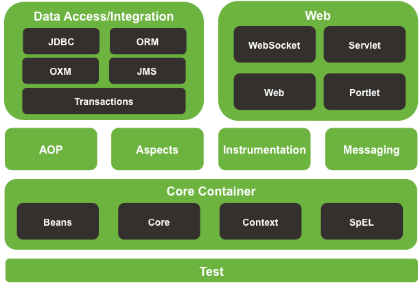
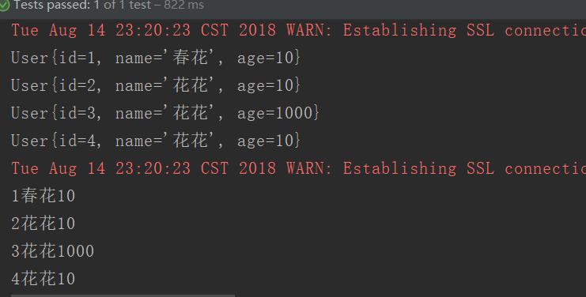
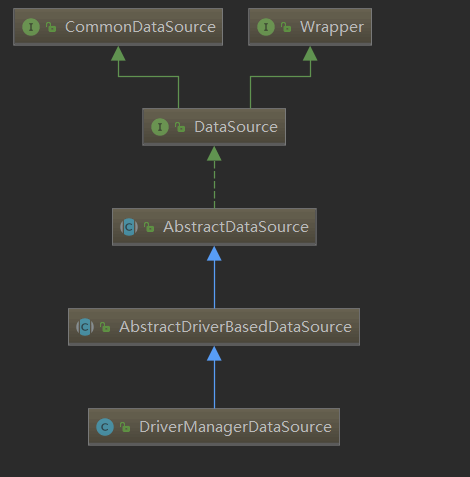
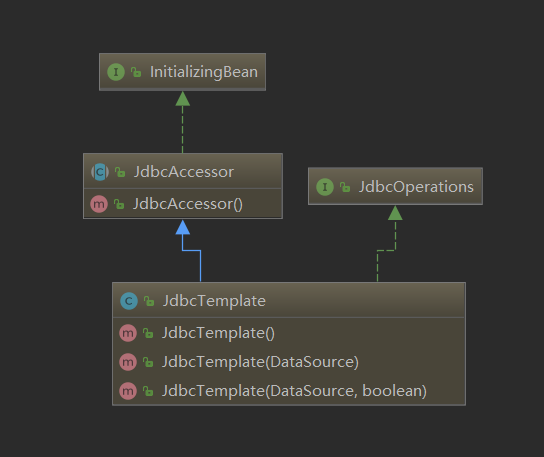
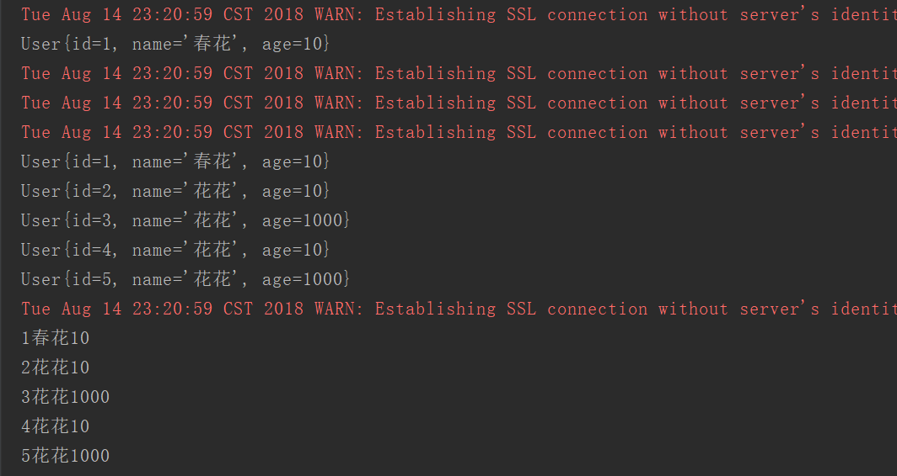

# 原生jdbc与spring整合

## JDBC介绍

JDBC API 允许用户访问任何形式的表格数据，尤其是存储在关系数据库中的数据。

执行流程：

- 连接数据源，如：数据库。
- 为数据库传递查询和更新指令。
- 处理数据库响应并返回的结果。

 

首先需要把jar包导进来，mysql-connector-java-6.0.6.jar，如果用maven把一下依赖添加进pom.xml

```xml
<!--mysql connnector-->
<dependency>
    <groupId>mysql</groupId>
    <artifactId>mysql-connector-java</artifactId>
    <version>6.0.6</version>
</dependency>
<!--end-->
```

### JDBC 编程步骤

1. 加载驱动程序： 
2. 获得数据库连接 
3. 创建Statement\PreparedStatement对象： 

> 正在加载类`com.mysql.jdbc.Driver'。 这已被弃用。 新的驱动程序类是`com.mysql.cj.jdbc.Driver'。 驱动程序通过SPI自动注册，通常不需要手动加载驱动程序类。

## 准备数据表

```sql
CREATE DATABASE suveng DEFAULT CHARACTER SET utf8 COLLATE utf8_general_ci;

use suveng;
create table user(
	id int NOT NULL PRIMARY KEY auto_increment,
	name VARCHAR(50) ,
	age int 
) DEFAULT CHARACTER SET utf8 COLLATE utf8_general_ci;
```

## 原生JDBC示例：

```java
/**
 * @author Veng Su 1344114844@qq.com
 * @date 2018/8/14 21:03
 */

public class DBUtils {
    private String url;
    private String username;
    private String password;

    public String getUrl() {
        return url;
    }

    public void setUrl(String url) {
        this.url = url;
    }

    public String getUsername() {
        return username;
    }

    public void setUsername(String username) {
        this.username = username;
    }

    public String getPassword() {
        return password;
    }

    public void setPassword(String password) {
        this.password = password;
    }

    public static void main(String[] args) throws ClassNotFoundException, SQLException {
        DBUtils dbUtils=new DBUtils();
        dbUtils.setUrl("jdbc:mysql://localhost:3306/suveng?serverTimezone=Asia/Shanghai&characterEncoding=utf8");
        dbUtils.setUsername("root");
        dbUtils.setPassword("root");
//        1. 加载驱动
        Class.forName("com.mysql.cj.jdbc.Driver");
        //2. 获得数据库连接
        Connection conn = DriverManager.getConnection(dbUtils.getUrl(), dbUtils.getUsername(), dbUtils.getPassword());
        //3.操作数据库，实现增删改查
        //预编译SQL，减少sql执行
        String sql="INSERT INTO user (name, age) VALUES ('suveng', 22)";
        PreparedStatement  stmt = conn.prepareStatement(sql);
        stmt.executeUpdate();

        ResultSet rs2 = stmt.executeQuery("SELECT * FROM user");
        //如果有数据，rs.next()返回true
        while(rs2.next()){
            System.out.println(rs2.getString("name")+" 年龄："+rs2.getInt("age"));
        }
    }
}
```

这是使用原生的jdbc链接数据库和增查操作，然而我们spring已经封装了jdbc了，这样让我们的操作变得更简单。

## Spring JDBC示例

 

### 编程步骤：

1. 配置数据源datasource
2. 初始化jdbcTemplate
3. 使用jdbcTemplate对数据库做增删查改

```java
/**
 * @author Veng Su 1344114844@qq.com
 * @date 2018/8/14 22:14
 */
public class SpringJDBCDemo {
   @Test
    public void springJDBCTest() {
        //初始化DataSource
        DriverManagerDataSource driverManagerDataSource = new DriverManagerDataSource();
        driverManagerDataSource.setDriverClassName("com.mysql.cj.jdbc.Driver");
        driverManagerDataSource.setUrl("jdbc:mysql://localhost:3306/suveng?serverTimezone=Asia/Shanghai&characterEncoding=utf8");
        driverManagerDataSource.setUsername("root");
        driverManagerDataSource.setPassword("root");
        //初始化jdbcTemplate
        JdbcTemplate jdbcTemplate = new JdbcTemplate(driverManagerDataSource);
        // 查询一条数据
        User user1 = jdbcTemplate.queryForObject("select * from user where id = ?", new BeanMapper(), 1);
        System.out.println(user1);

        // 删除
//         jdbcTemplate.update("delete from user where id = ?", 1);

        // 修改
        jdbcTemplate.update("update user set name = ? where id = ?", "春花", 1);

        // 插入
        jdbcTemplate.update("insert into user(name,age) values( '花花', 10)");

        // 方式2：查询所有的数据
        List<User> list2 = jdbcTemplate.query("select * from user", new BeanMapper());

        for (User user : list2) {
            System.out.println(user);
        }
        // 方式1： 查询所有的数据
        List<Map<String, Object>> list = jdbcTemplate.queryForList("select * from user");
        for (Map<String, Object> map : list) {
            //  map.keySet() 用于获取所有的 key
            for (String key : map.keySet()) {
                // 通过 key 获取到对应的 value 值
                System.out.print(map.get(key));
            }
            // 相当于换行效果
            System.out.println();
        }

    }

    private class BeanMapper implements org.springframework.jdbc.core.RowMapper<User> {
        // 查询的时候，有可能会返回多个数据，所有的数据都会放在 rs 结果集中
        // rounum 代表的是记录的下表值
        public User mapRow(ResultSet resultSet, int i) throws SQLException {
            User user=new User();
            user.setId(resultSet.getInt("id"));
            user.setName(resultSet.getString("name"));
            user.setAge(resultSet.getInt("age"));
            return user;
        }
    }
}
```

测试：

运行结果;



### 问题

> 为什么是用jdbcTemplate需要传datasource？
>
> 这个可以通过类图说明，初始化jdbcTemplate需要一个datasource接口
>
> 而，DriverManagerDateSource的父类实现了dataSource接口，所以可以传进去构造。如下图。

DriverManagerDateSource



JdbcTemplate



既然可以new 出来的实例，我们应该交给spring去管理。

在beans.xml配置DataSource和jdbcTemplate

```xml
<!--配置DataSource-->
<bean id="dataSource" class="org.springframework.jdbc.datasource.DriverManagerDataSource">
    <property name="driverClassName" value="com.mysql.cj.jdbc.Driver"/>
    <property name="url" value="jdbc:mysql://localhost:3306/suveng?serverTimezone=Asia/Shanghai &amp;characterEncoding=utf8"/>
    <property name="username" value="root"/>
    <property name="password" value="root"/>
</bean>
<!--配置jdbcTemplate-->
<bean id="jdbcTemplate" class="org.springframework.jdbc.core.JdbcTemplate">
    <property name="dataSource" ref="dataSource"/>
</bean>
```

配置好了，我们可以开始注入了。

```java
/**
 * @author Veng Su 1344114844@qq.com
 * @date 2018/8/14 22:14
 */
@RunWith(SpringJUnit4ClassRunner.class)
@ContextConfiguration("classpath:spring/config/beans.xml")
public class SpringJDBCDemo {
    @Resource
    JdbcTemplate jdbcTemplate;
    @Test
    public void springJDBCXMLTest(){
        // 查询一条数据
        User user1 = jdbcTemplate.queryForObject("select * from user where id = ?", new BeanMapper(), 1);
        System.out.println(user1);

        // 删除
//         jdbcTemplate.update("delete from user where id = ?", 1);

        // 修改
        jdbcTemplate.update("update user set name = ? where id = ?", "春花", 1);

        // 插入
        jdbcTemplate.update("insert into user(name,age) values( ?, ?)", "花花", 1000);

        // 方式2：查询所有的数据
        List<User> list2 = jdbcTemplate.query("select * from user", new BeanMapper());

        for (User user : list2) {
            System.out.println(user);
        }
        // 方式1： 查询所有的数据
        List<Map<String, Object>> list = jdbcTemplate.queryForList("select * from user");
        for (Map<String, Object> map : list) {
            //  map.keySet() 用于获取所有的 key
            for (String key : map.keySet()) {
                // 通过 key 获取到对应的 value 值
                System.out.print(map.get(key));
            }
            // 相当于换行效果
            System.out.println();
        }

    }
    @Test
    public void springJDBCTest() {
        //初始化DataSource
        DriverManagerDataSource driverManagerDataSource = new DriverManagerDataSource();
        driverManagerDataSource.setDriverClassName("com.mysql.cj.jdbc.Driver");
        driverManagerDataSource.setUrl("jdbc:mysql://localhost:3306/suveng?serverTimezone=Asia/Shanghai&characterEncoding=utf8");
        driverManagerDataSource.setUsername("root");
        driverManagerDataSource.setPassword("root");
        //初始化jdbcTemplate
        JdbcTemplate jdbcTemplate = new JdbcTemplate(driverManagerDataSource);
        // 查询一条数据
        User user1 = jdbcTemplate.queryForObject("select * from user where id = ?", new BeanMapper(), 1);
        System.out.println(user1);

        // 删除
//         jdbcTemplate.update("delete from user where id = ?", 1);

        // 修改
        jdbcTemplate.update("update user set name = ? where id = ?", "春花", 1);

        // 插入
        jdbcTemplate.update("insert into user(name,age) values( '花花', 10)");

        // 方式2：查询所有的数据
        List<User> list2 = jdbcTemplate.query("select * from user", new BeanMapper());

        for (User user : list2) {
            System.out.println(user);
        }
        // 方式1： 查询所有的数据
        List<Map<String, Object>> list = jdbcTemplate.queryForList("select * from user");
        for (Map<String, Object> map : list) {
            //  map.keySet() 用于获取所有的 key
            for (String key : map.keySet()) {
                // 通过 key 获取到对应的 value 值
                System.out.print(map.get(key));
            }
            // 相当于换行效果
            System.out.println();
        }

    }


    private class BeanMapper implements org.springframework.jdbc.core.RowMapper<User> {
        // 查询的时候，有可能会返回多个数据，所有的数据都会放在 rs 结果集中
        // rounum 代表的是记录的下表值
        public User mapRow(ResultSet resultSet, int i) throws SQLException {
            User user=new User();
            user.setId(resultSet.getInt("id"));
            user.setName(resultSet.getString("name"));
            user.setAge(resultSet.getInt("age"));
            return user;
        }
    }
}
```

运行结果：



## 码云代码地址：

https://gitee.com/suwenguang/SpringFrameworkDemo

donwnload下来后，其中src/main/java/spring/my/suveng/jdbc才是本文的代码源。其他是其他文章的引用。

## 结论

这就是使用spring jdbc 的快捷之处。更多的对jdbc的探索还是需要时间去研究。加油

