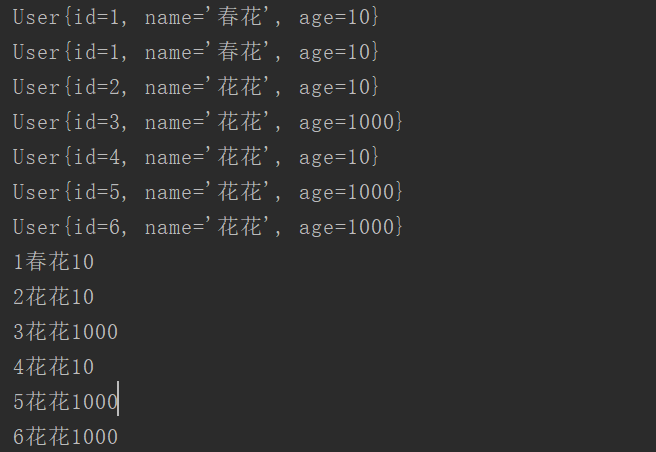

# Spring 整合C3P0连接池

> 注意：环境 jdk1.8 ，idea 2018，maven，spring环境
>
> 代码存放在码云里面。

## 码云地址

https://gitee.com/suwenguang

> 注意这个工程还有我其他demo，本文目录在spring.my.suveng.jdbc.c3p0JDBC 目录里面
>
> spring 配置再spring.config 目录下

## 什么是连接池？

连接池允许多个客户端使用缓存起来的链接对象，这些对象是共享的，可重用的。

## 为什么要连接池？

打开/关闭数据库连接开销很大，连接池技术允许我们在连接池里维护连接对象，这样可以提高数据库的执行命令的性能 

## 连接池运行原理

多个客户端请求可以重复使用相同的连接对象，当每次收到一个客户端请求时，就会搜索连接池，看看有没有闲置的连接对象。如果没有闲置对象的话，要么所有的客户端请求都进入队列排队，要么在池中创建一个新的连接对象（这取决于池里已经有多少个连接存在以及配置支持多少连接）。一旦某个请求使用完连接对象之后，这个对象会被重新放入池中，然后会被重新分派给排队等待的请求（分派给哪个请求要看使用什么调度算法） 。

因为大部分请求都是使用现存的连接对象，所以连接池技术大大减少了等待创建数据库连接的时间，从而减少了平均连接时间 

## spring整合c3p0连接池

1. 导入jar包：c3p0 (使用maven导入依赖，只是部分pom.xml)

   ```xml
    <!--c3p0 连接池-->
           <dependency>
               <groupId>c3p0</groupId>
               <artifactId>c3p0</artifactId>
               <version>RELEASE</version>
           </dependency>
           <dependency>
               <groupId>com.mchange</groupId>
               <artifactId>mchange-commons-java</artifactId>
               <version>0.2.11</version>
           </dependency>
           <!--end-->
   ```

2. 配置c3p0数据源。（这里并没有整合 mybatis的框架，使用的是spring JDBC）


```xml
<?xml version="1.0" encoding="UTF-8"?>

<beans xmlns="http://www.springframework.org/schema/beans"
       xmlns:xsi="http://www.w3.org/2001/XMLSchema-instance"
       xmlns:context="http://www.springframework.org/schema/context"
       xmlns:aop="http://www.springframework.org/schema/aop"
       xmlns:tx="http://www.springframework.org/schema/tx"
       xsi:schemaLocation="http://www.springframework.org/schema/beans
        http://www.springframework.org/schema/beans/spring-beans.xsd
        http://www.springframework.org/schema/context
        http://www.springframework.org/schema/context/spring-context.xsd
        http://www.springframework.org/schema/aop
        http://www.springframework.org/schema/aop/spring-aop.xsd
        http://www.springframework.org/schema/tx
        http://www.springframework.org/schema/aop/spring-tx.xsd">

    <context:component-scan base-package="spring.my.suveng"/>

    <!--使用注解配置aop 需要开启 切面自动代理-->
    <aop:aspectj-autoproxy/>
    <bean id="dataSource" class="com.mchange.v2.c3p0.ComboPooledDataSource">
        <property name="driverClass" value="com.mysql.cj.jdbc.Driver"/>
        <property name="jdbcUrl" value="jdbc:mysql://localhost:3306/suveng?serverTimezone=Asia/Shanghai &amp;characterEncoding=utf8"/>
        <property name="user" value="root"/>
        <property name="password" value="root"/>
    </bean>

    <!--配置jdbcTemplate-->
    <bean id="jdbcTemplate" class="org.springframework.jdbc.core.JdbcTemplate">
        <property name="dataSource" ref="dataSource"/>
    </bean>
</beans>
```

## 测试

```java
/**
 * author Veng Su
 * email suveng@163.com
 * date 2018/8/16 18:56
 */
@RunWith(SpringJUnit4ClassRunner.class)
@ContextConfiguration("classpath:spring/my/suveng/jdbc/c3p0JDBC/spring_config/spring_c3p0.xml")
public class C3p0Test {
    @Resource
    JdbcTemplate jdbcTemplate;

    @Test
    public void testC3p0() {
        // 查询一条数据
        User user1 = jdbcTemplate.queryForObject("select * from user where id = ?", new C3p0Test.BeanMapper(), 1);
        System.out.println(user1);

        // 删除
//         jdbcTemplate.update("delete from user where id = ?", 1);

        // 修改
        jdbcTemplate.update("update user set name = ? where id = ?", "春花", 1);

        // 插入
        jdbcTemplate.update("insert into user(name,age) values( ?, ?)", "花花", 1000);

        // 方式2：查询所有的数据
        List<User> list2 = jdbcTemplate.query("select * from user", new C3p0Test.BeanMapper());

        for (User user : list2) {
            System.out.println(user);
        }
        // 方式1： 查询所有的数据
        List<Map<String, Object>> list = jdbcTemplate.queryForList("select * from user");
        for (Map<String, Object> map : list) {
            //  map.keySet() 用于获取所有的 key
            for (String key : map.keySet()) {
                // 通过 key 获取到对应的 value 值
                System.out.print(map.get(key));
            }
            // 相当于换行效果
            System.out.println();
        }
    }
    private class BeanMapper implements org.springframework.jdbc.core.RowMapper<User> {
        // 查询的时候，有可能会返回多个数据，所有的数据都会放在 rs 结果集中
        // rounum 代表的是记录的下表值
        public User mapRow(ResultSet resultSet, int i) throws SQLException {
            User user=new User();
            user.setId(resultSet.getInt("id"));
            user.setName(resultSet.getString("name"));
            user.setAge(resultSet.getInt("age"));
            return user;
        }
    }

}
```

## 运行结果



使用spring JDBC 进行操作。数据源配置其实是很简单的。到这里配置完成，连接池还有其他配置可以选择。加油。


