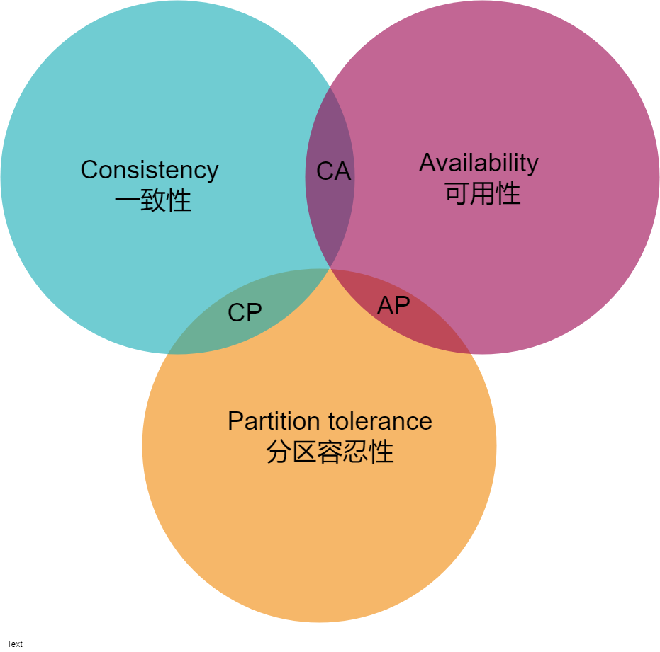

# CAP理论

## 定义

CAP原则 ，指的是一个分布式系统中，一致性 Consistency，可用性 Availability，分区容错性 Partition tolerance，三者不可兼得。

如下图

## Consistency 一致性

想Java中的线程安全中一样，写操作之后， 读到的数据，必须是写操作后的值。

## Partition tolerance 分区容错性

先看 Partition tolerance ，中文叫做 " 分区容错 " 。
大多数分布式系统都分布在多个子网络。每个子网络就叫做一个区（ partition ）。分区容错的意思是，区间通信可能失
败。比如，一台服务器放在中国，另一台服务器放在美国，这就是两个区，它们之间可能无法通信

**一般来说，分区容错无法避免，因此可以认为 CAP 的 P 总是成立。 CAP 定理告诉我们，剩下的 C 和 A 无法同时做到。**

## Availability 可用性

只要收到用户的请求，服务器就必须给出回应。

## Consistency 和 Availability 的矛盾

一致性和可用性，为什么不可能同时成立？答案很简单，因为可能通信失败（即出现分区容错）。
如果保证 G2 的一致性，那么 G1 必须在写操作时，锁定 G2 的读操作和写操作。只有数据同步后，才能重新开放读写。
锁定期间， G2 不能读写，没有可用性不。
如果保证 G2 的可用性，那么势必不能锁定 G2 ，所以一致性不成立。
综上所述， G2 无法同时做到一致性和可用性。系统设计时只能选择一个目标。如果追求一致性，那么无法保证所有节点的可用性；如果追求所有节点的可用性，那就没法做到一致性。

## 参考文献：

[悦码](https://mp.weixin.qq.com/s?src=11&timestamp=1533648966&ver=1046&signature=WfquDnGtYEbTFCv7iQVLDt3iyPtCUPlI8lLiev6d4szLapZ9z021RV-EBbE9ahbWVVVaMaE2jAeC041IjIZu5mMRKOJJUqcA4DoD6Hk*WaRctioWoDlrz0YdC1sl2hF5&new=1)

