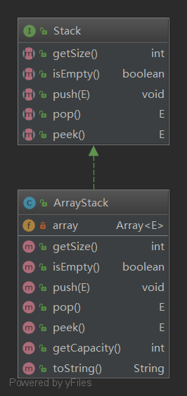

# 自己动手写数据结构之数组实现栈

## 环境： jdk1.8 

## 设计思路

首先使用上次封装好的动态数组实现一个栈的数据结构。动态数组的链接：https://blog.csdn.net/qq_37933685/article/details/81427609

由于栈的操作是固定，实现它的数据结构有多种，这里使用栈作为一个Stack接口。

用数组实现栈，称它为ArrayStack.

## 类图



## 类结构解析

Stack接口有5个操作

1. getSize() 获取当前栈的元素个数
2. isEmpty() 查询当前栈是否为空
3. push() 入栈
4. pop() 出栈
5. peek() 查看栈顶元素

ArrayStack实现Stack 接口

1. 重写toString()
2. getCapacity() 获取数组容量

码云地址：https://gitee.com/suwenguang/test

## 时间复杂度分析

由于底层是动态数组，时间复杂度的局限由动态数组决定。

|         操作          | 时间复杂度 |
| :-------------------: | :--------: |
| 入栈：array.addLast() |    O(1)    |
|         出栈          |    O(1)    |

### 说明

入栈：入栈使用的是Array.addLast(), 在 [封装动态数组篇](https://blog.csdn.net/qq_37933685/article/details/81427609#t5) 中讲到 ，add 操作平均复杂度是O(n) 的，在不扩容的情况下，想数组末尾添加元素的时间复杂度是O(1)的。 

出栈：出栈使用的是array.removeLast(),删除数组的末尾元素，是不需要数组元素移位的，在不缩容的情况下，它的时间复杂度也是O(1)

## 源码

```java
package 数据结构.栈.数组栈;

import 数据结构.数组.Array;
import 数据结构.栈.Stack;

/**
 * @author Veng Su 1344114844@qq.com
 * @date 2018/7/16 16:29
 */
public class ArrayStack<E> implements Stack<E> {
    private Array<E> array;

    ArrayStack(int capacity) {
        array = new Array<>(capacity);
    }

    ArrayStack() {
        array = new Array<>();
    }

    @Override
    public int getSize() {
        return array.getSize();
    }

    @Override
    public boolean isEmpty() {
        return array.isEmpty();
    }

    @Override
    public void push(E e) {
        array.addLast(e);
    }

    @Override
    public E pop() {
        return array.removeLast();
    }

    @Override
    public E peek() {
        return array.getLast();
    }

    public int getCapacity() {
        return array.getCapacity();
    }

    @Override
    public String toString() {
        StringBuilder stringBuilder=new StringBuilder();
        stringBuilder.append("ArrayStack: [");
        for (int i = 0; i < array.getSize(); i++) {
            stringBuilder.append(array.get(i));
            if (i!=array.getSize()){
                stringBuilder.append(",");
            }
        }
        stringBuilder.append("] top");

        return stringBuilder.toString();
    }
}

```

