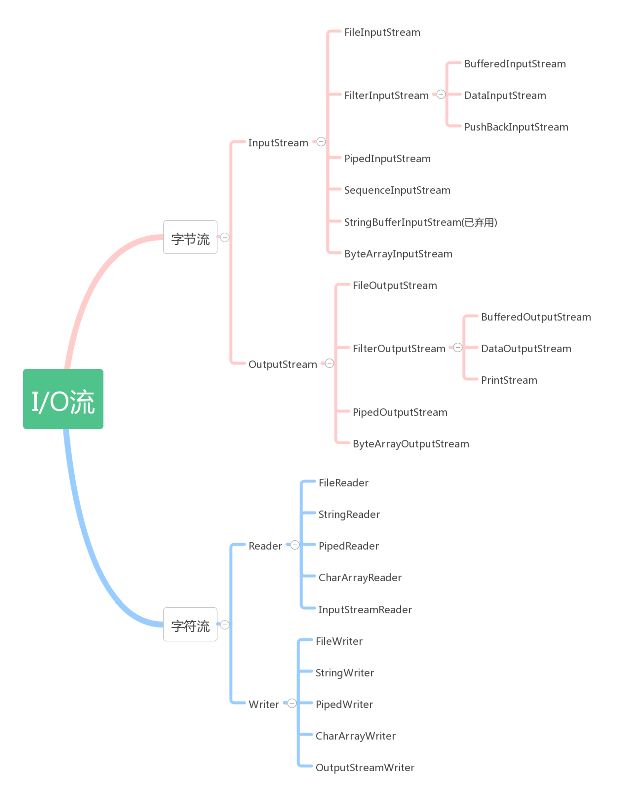

# 面试之IO

## 普通io操作

### InputStream

InputStream 为字节输入流，它本身为一个抽象类，必须依靠其子类实现各种功能，此抽象类是表示字节输入流的所有类的超类。 继承自InputStream 的流都是向程序中输入数据的，且数据单位为字节（8bit）；

1. FileInputStream把一个文件作为InputStream，实现对文件的读取操作
2. ByteArrayInputStream：把内存中的一个缓冲区作为InputStream使用
3. StringBufferInputStream：把一个String对象作为InputStream
4. PipedInputStream：实现了pipe的概念，主要在线程中使用
5. SequenceInputStream：把多个InputStream合并为一个InputStream

### OutputStream

几种不同的OutputStream：

1. ByteArrayOutputStream：把信息存入内存中的一个缓冲区中
2. FileOutputStream：把信息存入文件中
3. PipedOutputStream：实现了pipe的概念，主要在线程中使用
4. SequenceOutputStream：把多个OutStream合并为一个OutStream

### **按来源/去向分类：**

1. File（文件）： FileInputStream, FileOutputStream, FileReader, FileWriter
2. byte[]：ByteArrayInputStream, ByteArrayOutputStream
3. Char[]: CharArrayReader, CharArrayWriter
4. String: StringBufferInputStream, StringReader, StringWriter
5. 网络数据流：InputStream, OutputStream, Reader, Writer

### 如何选择I/O流

1. 是否需要转换流
   是，就使用转换流，从Stream转化为Reader、Writer：InputStreamReader，OutputStreamWriter
2. 是否需要缓冲提高效率
   是就加上Buffered：BufferedInputStream, BufferedOuputStream, BufferedReader, BufferedWriter